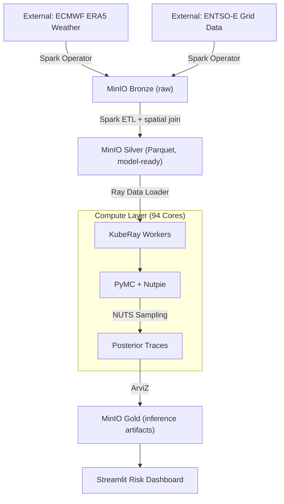

# Pan-European Grid Resilience: Probabilistic Shortfall Modeling

A Distributed Bayesian System for Quantifying Energy Security Risks using Spatio-Temporal Gaussian Processes.

## Executive Summary

As renewable penetration increases, the European energy grid faces unprecedented volatility. Standard deterministic models fail to capture the tail risks of simultaneous wind droughts across interconnected regions (e.g., low wind in both Denmark and Northern Germany). This platform ingests ERA5 (ECMWF weather reanalysis) and ENTSO-E (load, generation, cross-border flows) for 50+ European regions to model the joint probability of Loss of Load Events (LOLE).

**Key Technical Differentiator:** Standard Gaussian Processes scale at O(N³), making them infeasible for 5 years of hourly data across Europe. The Hilbert Space Gaussian Process (HSGP) approximation reduces complexity to O(N·m²), distributed across a 94-core bare-metal Kubernetes cluster using Ray and PyMC/Nutpie.

## System Architecture



## Infrastructure Stack

- **Orchestration:** Kubernetes (Talos Linux) + Flux (GitOps)
- **Compute:** KubeRay (Ray Cluster) + Spark Operator
- **Storage:** MinIO (local) or Ceph RGW (homelab) — Bronze/Silver/Gold buckets. See [docs/infrastructure-alignment.md](docs/infrastructure-alignment.md).
- **Observability:** Prometheus, Grafana
- **Inference:** PyMC (probabilistic programming), Nutpie (Rust-based NUTS sampler)

## The Mathematics: Why HSGP?

**The Problem:** Modeling energy shortfall requires understanding spatial correlation between regions (e.g., wind in Denmark vs. Sweden). Standard GPs scale at O(N³), making them impossible for 5 years of hourly data across Europe (N > 40,000).

**The Solution:** Hilbert Space Approximation (HSGP). We approximate the stationary GP covariance using a basis function expansion based on the Laplacian eigenstructure in a finite domain:

$$f(x) \approx \sum_{j=1}^{m} \beta_j \phi_j(x)$$

Where βⱼ are spectral coefficients with independent Gaussian priors. This reduces complexity from O(N³) to O(N·m²), enabling training on millions of data points linearly.

## Key Engineering Features

- **Distributed inference on Ray:** KubeRay spawns ephemeral Ray actors per climate zone. Nutpie (Rust NUTS) provides ~10× speedup over Python samplers, saturating AVX-512 instructions on cluster CPUs.
- **Reproducible data lakehouse:** Bronze (raw NetCDF/XML) → Silver (Parquet, spatially joined weather + grid data) → Gold (P10/P50/P90 inference artifacts as NetCDF).
- **Self-healing compute:** Ray head node detects worker failures and reschedules chains to healthy nodes without restarting the job.

## Repo Structure

```
proj-grid-resilience/
├── data-engineering/           # Spark: ERA5 + ENTSO-E ingest, spatial ETL
│   ├── processing/
│   │   ├── spark-era5-ingest.yaml
│   │   └── spark-entsoe-ingest.yaml
│   └── README.md
│
├── inference/                  # KubeRay: distributed HSGP with Nutpie
│   ├── bayesian-grid-model.yaml
│   └── README.md
│
├── infrastructure/             # Flux kustomizations: MinIO, Ray, Spark
│   └── README.md
│
├── dashboard/                  # Streamlit Risk Map (P10/P50/P90)
│   ├── app.py
│   ├── requirements.txt
│   ├── Dockerfile
│   └── README.md
│
├── generator/                  # MVP: synthetic data (8 Nordic zones)
│   ├── Dockerfile
│   ├── requirements.txt
│   ├── generate.py
│   └── README.md
│
├── pipeline/                   # MVP: Dagster + HSGP model
│   ├── dagster/
│   ├── model/
│   ├── streaming/
│   └── ...
│
├── api/                        # MVP: FastAPI forecast service
│   ├── main.py
│   ├── routers/
│   └── ...
│
├── scripts/
├── docs/
└── .github/workflows/
```

## How to Run

### Full Platform (Kubernetes)

**Prerequisites:** Access to a Kubernetes cluster with at least 32 GB RAM and AVX2 support. Storage uses **Rook-Ceph** (Ceph RGW) with Bronze/Silver/Gold buckets; deployment and Flux GitOps live in **home-ops-upgrade**. This repo provides the application code and reference K8s manifests (SparkApplication, RayJob); apply or kustomize them from home-ops as needed.

1. **Bootstrap infrastructure** (Flux GitOps):

   ```bash
   flux reconcile kustomization infrastructure --with-source
   ```

2. **Ingest data:** Start with ERA5 (ECMWF). Configure CDS API (`~/.cdsapirc`), then run the fetch script or Spark job:

   ```bash
   cd data-engineering && pip install -r requirements.txt
   python scripts/fetch_era5_nordic.py --start 2023-01 --end 2023-12 --output-dir ./era5_nordic
   ```

   Optionally upload to Bronze with `--upload-bronze` (set `BRONZE_*` env). In-cluster, use SparkApplication when the Spark Operator is available:

   ```bash
   kubectl apply -f data-engineering/processing/spark-era5-ingest.yaml
   ```

3. **Trigger distributed inference** (RayJob):

   ```bash
   kubectl apply -f inference/bayesian-grid-model.yaml
   ```

4. **View the dashboard** (port-forward Streamlit):

   ```bash
   kubectl port-forward svc/grid-dashboard 8501:8501
   ```

### MVP / Local Development (Synthetic Data)

For local development and demos, use synthetic data for 8 Nordic zones (no external data or K8s required).

**1. Start PostgreSQL and MinIO (Docker):**

```bash
docker compose up -d
```

**2. Configure env:** Copy `.env.example` to `.env` in the repo root (or add the MinIO vars to your existing `.env`). The pipeline needs `MINIO_ENDPOINT`, `MINIO_ACCESS_KEY`, and `MINIO_SECRET_KEY` to run.

```bash
cp .env.example .env
```

**3. Generator:**

```bash
cd generator
pip install -r requirements.txt
python generate.py
```

**4. Pipeline:** Run from repo root (not from `pipeline/`) so the Dagster code server finds the framework correctly:

```bash
cd C:\Users\ekenh\proj-grid-resilience
pip install -r pipeline/requirements.txt
dagster dev -m pipeline.dagster.repository
```

Or use the newer CLI: `dg dev -m pipeline.dagster.repository`

**5. API:**

```bash
cd api
pip install -r requirements.txt
uvicorn main:app --reload
```

## Results & Artifacts

| Region | P10 Shortfall (MW) | P90 Shortfall (MW) | Conditional Risk |
|--------|--------------------|--------------------|------------------|
| SE3 (Stockholm) | 0 | 150 | Low |
| SE4 (Malmö) | 200 | 1200 | High (if DE_Wind < 10%) |

## License & Data Citations

**Data:** ERA5 (ECMWF), ENTSO-E Transparency Platform.

**License:** MIT.
