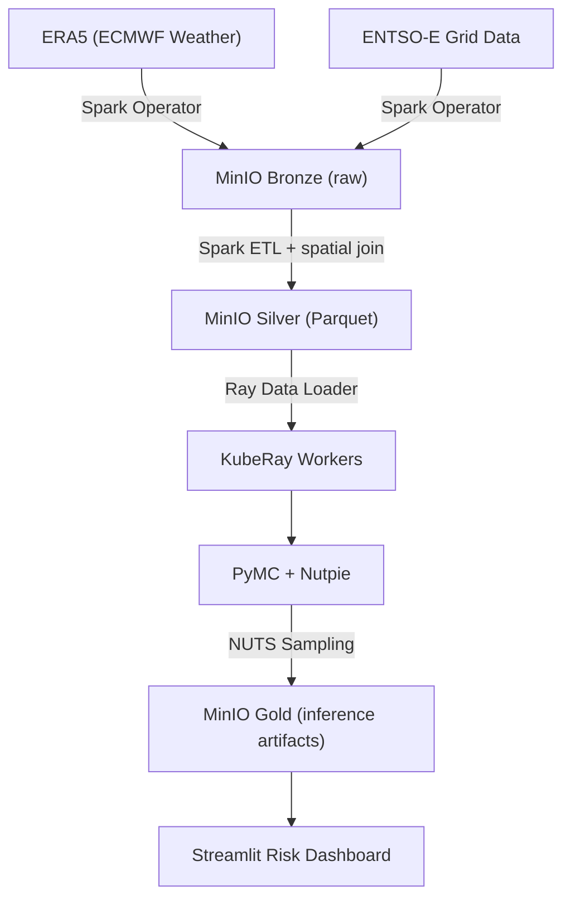

# Grid Resilience Architecture

## Overview

This system is a platform, not a script. It runs on a custom Talos Linux cluster managed via GitOps (Flux). It ingests petabyte-scale weather data (ERA5) and energy flow data (ENTSO-E) to model the joint probability of Loss of Load Events (LOLE) across 50+ European regions.

## Full Platform Data Flow

1. **ERA5 + ENTSO-E** → Spark Operator ingests raw NetCDF (weather) and XML/CSV (energy) into **MinIO Bronze**.
2. **Spark ETL** performs spatial join of weather and grid data, writes model-ready Parquet to **MinIO Silver**.
3. **Ray Data Loader** streams Silver data to **KubeRay workers**.
4. **PyMC + Nutpie** runs distributed NUTS sampling; posterior traces and P10/P50/P90 artifacts written to **MinIO Gold**.
5. **Streamlit Risk Dashboard** reads from Gold and displays probabilistic shortfall risk by region.

## MVP Path (Local Development)

For local development without Kubernetes or external data sources:

- **generator/** produces synthetic weather/grid data (8 Nordic zones × 5 years hourly) with Matern spatial covariance. Writes to PostgreSQL partitioned tables.
- **pipeline/** (Dagster) loads from PostgreSQL, trains HSGP with SVI, stores forecasts in MinIO.
- **api/** serves `/forecast/{region_id}` and `/correlations` from PostgreSQL/MinIO.

See `generator/`, `pipeline/`, and `api/` READMEs for run instructions.

## Phases

**Phase 1 — Core Platform**

- Real data ingestion (ERA5, ENTSO-E) via Spark
- HSGP model with distributed inference (KubeRay + Nutpie)
- MinIO Bronze/Silver/Gold lakehouse
- Streamlit Risk Dashboard

**Phase 2 — Streaming & Alerting**

- Bytewax spatial windowing and anomaly detection
- Redpanda integration
- Risk alert publishing
- Superset geo risk dashboard
